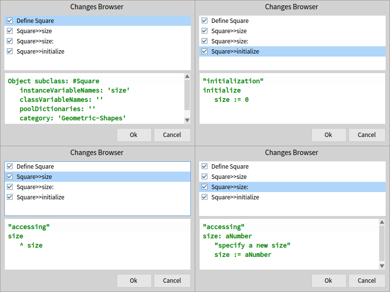

# Changes Builder
[](https://travis-ci.org/peteruhnak/pharo-changes-builder) [](https://coveralls.io/github/peteruhnak/pharo-changes-builder?branch=master)

A small wrapper library to simplify common RBRefactoring operations when generating code.

The main pupose is to prepare all code that you want to generate before hand and represent them as RBRefactorings, so you can review them before you accidentally break your system. ;)

On top of the generation, this library also fixes couple RBRefactoring issues, where RBRefactoring would show (and try to execute) a change that doesn't actually change anything. We filter this out, so you see only actual changes.


## Installation

```smalltalk
Metacello new
	baseline: 'ChangesBuilder';
	repository: 'github://peteruhnak/pharo-changes-builder/repository';
	load.
```

## Usage Example

```smalltalk
example
| cls getter setter init changeSet |
cls := CBClass new.
cls name: 'Square'.
"package name, default 'Unclassified'"
cls package: 'Geometric-Shapes'.
"the superclass of Square, default is Object"
cls parent: 'Object'.

"add an instance variable"
cls addInstVarNamed: 'size'.

"getter: is a convenience method that will generate a basic accessor in 'accessing' protocl"
getter := CBMethod new
	getter: 'size'.
"dtto for setter"
setter := CBMethod new
	setter: 'size' argument: 'Number' comment: 'specify a new size'.
"'hand'-written source is also possible"
init := CBMethod new
	source: 'initialize
	size := 0';
	protocol: 'initialization'.

cls addMethod: getter.
cls addMethod: setter.
cls addMethod: init.

changeSet := CBChangeSet new.
changeSet addClass: cls.

"ChangesBrowser can also be used, but it throws error on empty changeset"
^ (CBChangesBrowser changes: changeSet refactoringChanges) open.
```


